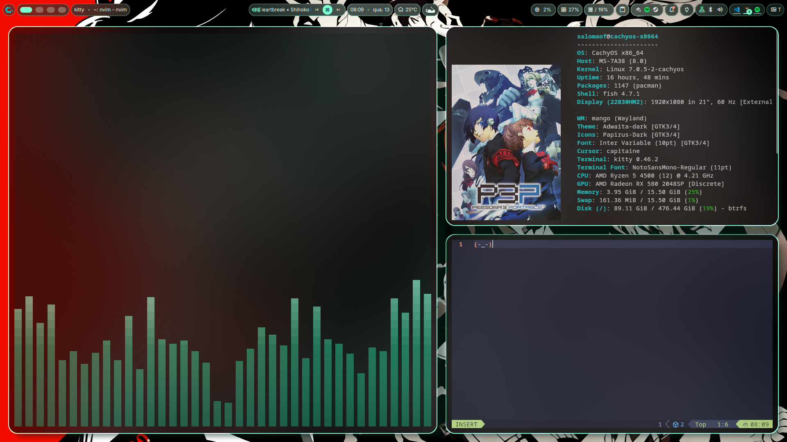

# sasal dotfiles

Personal CachyOS + mango/Wayland config snapshot.




## What is included

- DankMaterialShell / Quickshell settings, theme, and cat widget plugin
- fastfetch
- kitty and alacritty
- cava
- GTK 3 and GTK 4 theme settings
- neovim / LazyVim config
- micro editor settings and colorschemes
- spicetify theme config
- shelly config
- explicit pacman package list

## Install

Clone the repo and run:

```bash
./install.sh
```

The script backs up existing paths to `~/.config/dotfiles-backup-YYYYmmdd-HHMMSS`
and symlinks the configs into `~/.config`.

To copy files instead of symlinking:

```bash
./install.sh --copy
```

To also reinstall the explicit package list on an Arch/CachyOS system:

```bash
./install.sh --install-packages
```

Review `packages/pacman-explicit.txt` before using `--install-packages`; it mirrors
this machine and includes drivers and system packages.

## Notes

- Browser profiles, cookies, caches, logs, Spotify user state, and Sunshine
  credentials are intentionally not included.
- `DankMaterialShell/settings.json` contains a theme path. The install script
  rewrites the original home path to the current `$HOME` after installing.
- `assets/fastfetch.txt` is a text capture of the machine info used for the
  fastfetch image.
